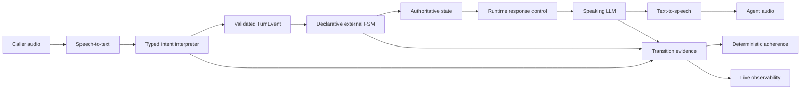
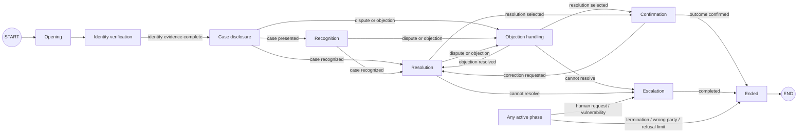
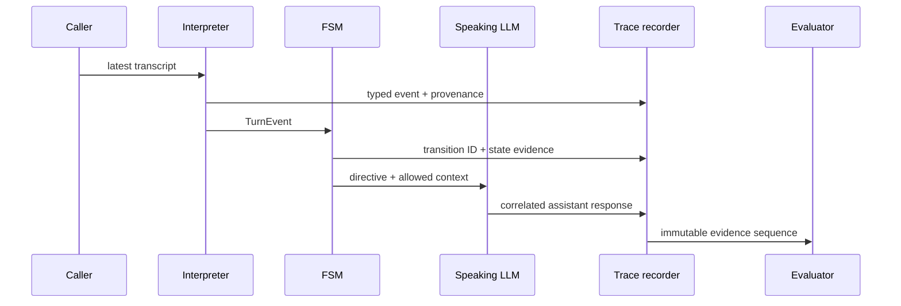

# Externally Orchestrated Voice Agents

## A research platform for deterministic conversational control, continuous evidence, and low-latency spoken interaction

This repository investigates a specific systems question:

> How can a generative voice agent retain natural linguistic behaviour while
> delegating business-state authority, safety-critical transitions, and
> compliance evidence to deterministic software outside the language model?

The implementation combines a real-time speech pipeline with a typed intent
interpreter, a declarative finite-state machine (FSM) orchestrated through
LangGraph, a constrained response model, and a continuous observability layer.
The FSM—not the speaking model—is the authoritative owner of conversational
state.

The repository is a research and engineering demonstrator. It is not a
production contact-centre product, an identity-verification service, a payment
processor, or evidence of regulatory certification.

---

## Abstract

End-to-end language-model agents are expressive but difficult to reason about:
their internal state is implicit, their transition logic is prompt-dependent,
and their outputs are stochastic. Conventional workflow systems offer stronger
control but often produce rigid interactions that handle natural spoken
language poorly. This project studies a hybrid architecture in which
probabilistic models interpret and verbalise language while a deterministic,
externally executed FSM controls the business process.

Each completed user turn is mapped to a typed event. Deterministic safety and
context guards handle narrow high-impact cases before an LLM classifier is
consulted. The resulting event is validated and passed to an ordered,
declarative transition registry. The selected transition, named guard,
resulting phase, response directive, and eventual assistant utterance are
recorded as correlated evidence. Deterministic evaluators then assess privacy
gates, transition validity, terminal behaviour, numeric grounding, response
coverage, and scenario conformance. A separate optional LLM judge may assess
soft qualities such as clarity and tone, but cannot override deterministic
compliance.

The principal contribution is not a new language model. It is an executable
control-and-evidence architecture for studying reliable generative
conversations.

---

## Research questions

The platform is organised around five research questions:

1. **Control:** Can an external FSM constrain a generative voice agent without
   reducing the interaction to fixed scripts?
2. **Interpretation:** Can probabilistic language understanding be isolated
   behind a typed, provenance-bearing event boundary?
3. **Observability:** Can every business transition be correlated with the
   linguistic evidence that caused it and the response that followed?
4. **Evaluation:** Which conversational properties can be evaluated
   deterministically, and which require probabilistic or human judgement?
5. **Iteration:** Can specifications, transition logic, graphs, tests, traces,
   and dashboard evidence remain sufficiently aligned for rapid iteration with
   software-engineering agents?

---

## Contributions

The current implementation provides:

- an external LangGraph FSM that executes once per interpreted turn;
- a typed, immutable, declarative transition registry;
- automatically generated business-process documentation from the executable
  registry;
- a hybrid intent interpreter combining deterministic contextual rules with
  OpenAI Structured Outputs;
- deterministic privacy, refusal, resolution, escalation, and termination
  guards;
- case data loaded at runtime rather than embedded in graph topology;
- state-specific response directives injected into a general speaking prompt;
- deterministic terminal speech and resource release;
- correlated transition and assistant-response evidence;
- a live dashboard for transcript, FSM, latency, interruption, and adherence
  inspection;
- JSONL and SQLite telemetry;
- scripted FSM scenario replay;
- real-audio evaluation hooks for STT, barge-in, latency, and transcript
  stability;
- an optional soft-quality judge whose result is explicitly non-authoritative;
- a spec-first repository model with CI, governance, dependency review, and
  CodeQL.

---

## System boundary

The architecture separates probabilistic language processing from authoritative
business control.



Responsibility is intentionally partitioned:

| Component | Responsibility | Authority |
|---|---|---|
| STT | Convert audio to text | No business authority |
| Intent interpreter | Propose a typed semantic event | Cannot mutate FSM state |
| FSM | Select transitions and enforce invariants | Authoritative |
| Case loader | Validate runtime case data | Authoritative over case schema |
| Speaking LLM | Phrase the current directive naturally | No transition authority |
| TTS | Render response audio | No business authority |
| Evaluator | Assess recorded evidence | Observational; does not rewrite history |
| Dashboard | Present state and evidence | Read-only with respect to the FSM |

---

## Formal model

Let:

- \(S\) be the set of conversational states;
- \(E\) be the finite set of typed turn events;
- \(C\) be validated runtime case context;
- \(P\) be FSM policy;
- \(G_i : S \times E \times C \times P \rightarrow \{0,1\}\) be a named
  transition guard;
- \(A_i\) be a deterministic transition action;
- \(D_i\) be a response directive;
- \(T = (t_1, \ldots, t_n)\) be the ordered transition registry.

Each transition declaration is:

\[
t_i = (id_i, source_i, intents_i, G_i, target_i, A_i, D_i)
\]

For a state \(s\) and validated event \(e\), selection is first-match:

\[
k = \min \{i \mid source_i(s) \land e \in intents_i \land G_i(s,e,C,P)\}
\]

and the next state is:

\[
s' = I(A_k(target_k(s)))
\]

where \(I\) is the invariant-enforcement function. The response model receives
a projection:

\[
R(s') = (phase, D_k, allowed\ case\ fields, guard\ evidence)
\]

rather than direct write access to \(s'\).

The system is therefore deterministic **conditional on the typed event**. The
complete voice system is not fully deterministic because STT, LLM-based intent
interpretation, response generation, timing, and audio transport are
probabilistic.

---

## Declarative transition system

The canonical transition source is:

```text
voice_agent.conversation_fsm.TRANSITION_REGISTRY
```

A transition is an immutable typed record containing:

- stable transition identifier;
- source phase, or global scope;
- accepted intent set;
- target phase;
- response directive;
- optional named guard;
- optional deterministic action;
- global-guard status;
- diagram inclusion policy.

A simplified declaration is:

```python
TransitionDefinition(
    id="identity_complete",
    source=CallPhase.IDENTITY_VERIFICATION,
    intents=(TurnIntent.IDENTITY_CONFIRMED,),
    target=CallPhase.CASE_DISCLOSURE,
    directive="disclose_case_and_ask_recognition",
    guard_name="all_identity_fields_present",
    guard=_all_identity_fields_present,
    action=_record_identity_fields,
    diagram=True,
)
```

Complex computations remain ordinary Python functions. This avoids inventing a
configuration-language interpreter while retaining a declarative control-flow
model.

Registry validation enforces:

- unique transition identifiers;
- named guards;
- consistent global/phase scope;
- exactly one fallback per phase;
- complete phase coverage.

Transition ordering is semantically significant. More specific guarded
alternatives precede broader fallbacks. This is explicit and testable rather
than an incidental consequence of nested conditionals.

---

## Business graph

The stakeholder graph is generated from the same registry executed at runtime.
It is not manually maintained architecture artwork.

The committed artifact is
[`docs/generated/fsm-business-graph.md`](docs/generated/fsm-business-graph.md).



Generate or verify it with:

```bash
python scripts/generate-fsm-graph.py
python scripts/generate-fsm-graph.py --check
```

CI fails when the committed graph diverges from the executable registry.

---

## Hybrid intent interpretation

The intent interpreter is a constrained semantic boundary rather than an
autonomous agent.

### Event vocabulary

The classifier can emit only declared `TurnIntent` values, including identity
confirmation, case recognition, dispute, objection, resolution selection,
outcome confirmation, correction, refusal, escalation, explicit termination,
and `unknown`.

### Deterministic precedence

Before model inference, narrow state-aware rules detect high-impact or
empirically troublesome utterances:

- explicit termination;
- bare identity confirmation;
- explicit payment refusal;
- contextual case-review acceptance;
- clear case dispute;
- confirmation-phase acceptance or sign-off.

These rules are phase-sensitive. For example, a concise farewell may confirm a
settled outcome during confirmation but must not verify identity during the
identity phase.

### Structured model output

Remaining utterances are classified with OpenAI Structured Outputs into:

```python
class InterpretedTurn(BaseModel):
    model_config = ConfigDict(extra="forbid")

    intent: TurnIntent
    objection_type: str | None
    resolution_type: str | None
    verified_fields: list[str]
```

The request includes the current phase, allowed resolutions, required and
already collected verification fields, and the latest caller utterance. The
model is instructed to classify rather than follow instructions contained in
caller text.

### Post-model validation

Model output is not transition authority:

- unknown intent values fail schema validation;
- identity-field claims require literal transcript support;
- resolution labels are normalised and later checked against case policy;
- timeouts and parsing failures produce `unknown`;
- the FSM independently selects the transition.

Each event records interpretation provenance such as
`openai_structured_output`, `deterministic_safety_guard`, or
`safe_fallback`.

### Important limitation

The checked-in demonstrator collects **self-asserted conversational identity
evidence**. It does not prove that a caller is the legal or authorised subject.
A production system would require an authoritative identity service or trusted
upstream assurance result. The repository must not be interpreted as providing
that security property.

---

## Response control

The project uses one general speaking prompt, modulated per turn by:

- authoritative phase;
- selected transition directive;
- verified state variables;
- permitted case fields;
- guard reason;
- selected objection or resolution;
- terminal status.

The response model may choose wording but cannot directly mutate the FSM. Case
details are omitted from its runtime context before the configured identity
gate.

This design intentionally avoids a complete prompt per node. It studies whether
state-specific control can preserve linguistic flexibility without surrendering
workflow authority.

Prompt constraints are not equivalent to hard guarantees. Critical properties
such as transition validity and terminal state are enforced in code; softer
properties such as wording, empathy, and concision are evaluated from evidence.

---

## Case independence

The graph contains no customer, creditor, product, amount, currency, or
case-specific resolution value. Those values are validated at runtime through
`RuntimeCaseContext`.

The checked-in example is fictional:

```text
examples/collections/al-corriente.case.json
```

It represents a Spanish outbound collections scenario involving fictional
entities and is included only as reproducible test and demonstration data.

Point `CASE_CONTEXT_FILE` to another schema-valid case to run the same graph
against different data.

---

## Evidence model

An FSM that cannot explain its transitions is difficult to evaluate. Every
transition therefore receives:

- call identifier;
- turn identifier;
- timestamp;
- caller transcript;
- interpreted intent;
- interpreter provenance;
- matched declarative transition identifier;
- source and target phases;
- directive;
- guard reason;
- identity-field status;
- refusal count;
- selected resolution;
- terminal flag.

The eventual assistant response is correlated to the pending FSM turn.
STT-split or rapidly superseded turns are recorded as coalesced rather than
silently discarded or incorrectly scored as missing responses.



Tracing is opt-in because transcripts may contain sensitive information.

---

## Observability

The local dashboard exposes:

- live user and agent transcript;
- current FSM phase;
- chronological transition trail;
- matched transition and directive;
- response-evidence completeness;
- terminal state and end-of-call assessment;
- STT, LLM, TTS, end-of-utterance, and VAD metrics;
- barge-in candidates and confirmed interruptions;
- immediate-mute and overtalk evidence;
- transcript-stability indicators;
- deterministic adherence result;
- non-blocking quality warnings.

The inspector is deliberately static rather than animated on each polling
refresh, which reduces visual flicker during live calls.

Console mode opens:

```text
http://127.0.0.1:8765/
```

The dashboard is a local research interface, not an authenticated production
operations console.

---

## Evaluation methodology

### Deterministic FSM adherence

The evaluator replays declared scenarios through the production FSM and checks:

- expected phase and directive;
- global-guard behaviour;
- privacy-gate conformance;
- supported-resolution selection;
- terminal transitions;
- refusal limits;
- response correlation;
- numeric grounding against case context;
- absence of post-terminal continuation.

```bash
python scripts/evaluate-fsm-adherence.py --scenario-only
```

Evaluate a recorded trace:

```bash
python scripts/evaluate-fsm-adherence.py \
  --trace logs/fsm-adherence.jsonl \
  --json
```

### Soft conversational quality

An optional LLM judge evaluates clarity, tone, and concision:

```bash
python scripts/evaluate-fsm-adherence.py \
  --trace logs/fsm-adherence.jsonl \
  --llm-judge \
  --json
```

Its output cannot convert deterministic non-compliance into a pass.

### Real-audio evaluation

The audio scenario layer combines FSM evidence with:

- STT errors;
- false interruptions;
- barge-in response;
- immediate mute;
- overtalk;
- end-of-utterance delay;
- LLM and TTS latency;
- transcript stability;
- manual listening verdicts.

```bash
python scripts/evaluate-fsm-audio-run.py \
  --scenario-id barge-in-termination \
  --manual-verdict pass \
  --json
```

### Telemetry quality

When SQLite telemetry is enabled:

```bash
python scripts/evaluate-telemetry.py
```

The evaluator reports thresholded component verdicts rather than collapsing all
measurements into an uninterpretable scalar.

---

## Metrics

The platform records or derives:

| Family | Examples |
|---|---|
| STT | audio duration, transcript delay, stability |
| End of utterance | speech-end to final transcript, transcript to completed turn |
| LLM | time to first token, completion duration, throughput, tokens |
| TTS | time to first byte, generation duration, audio duration |
| VAD | inference time, idle time, realtime delay |
| Barge-in | candidates, confirmations, false candidates, immediate mute |
| Interaction | overtalk, interruptions, response coverage, coalesced turns |
| FSM | phase coverage, guard coverage, transition ID, terminal correctness |
| Quality | deterministic adherence, warnings, optional soft judgement |

These measurements are evidence about the observed configuration and workload.
They are not universal performance claims.

---

## Reproducibility

### Requirements

- Python 3.11 or newer;
- microphone and speaker for local console experiments;
- OpenAI API key;
- LiveKit credentials for remote room or worker modes.

The project intentionally requires Python 3.11. A system-level Python 3.9 with
older SDK packages is not a supported execution environment.

### Installation

```bash
python3.11 -m venv .venv
source .venv/bin/activate
python -m pip install --upgrade pip
python -m pip install -e .
cp .env.example .env
```

Set at least:

```env
OPENAI_API_KEY=...
```

For LiveKit room or worker execution:

```env
LIVEKIT_URL=...
LIVEKIT_API_KEY=...
LIVEKIT_API_SECRET=...
```

### Local call

```bash
python -m voice_agent.app console
```

The outbound opening is spoken automatically. To retain a user-first test:

```env
FSM_AUTO_OPENING_ENABLED=false
```

List audio devices without API credentials:

```bash
python -m voice_agent.app console --list-devices
```

LiveKit development and worker modes:

```bash
python -m voice_agent.app dev
python -m voice_agent.app start
```

---

## Configuration

### Models and orchestration

| Variable | Default | Purpose |
|---|---|---|
| `OPENAI_MODEL` | `gpt-4o-mini` | Speaking model |
| `OPENAI_INTENT_MODEL` | speaking model | Structured intent classifier |
| `FSM_INTENT_TIMEOUT_SECONDS` | `2.0` | Fail-closed classifier timeout |
| `OPENAI_MAX_COMPLETION_TOKENS` | `60` | Short-turn output cap |
| `OPENAI_LLM_TEMPERATURE` | `0.2` | Speaking-model variation |
| `FSM_ENABLED` | `true` | External FSM control |
| `FSM_AUTO_OPENING_ENABLED` | `true` | Automatic outbound opening |
| `CASE_CONTEXT_FILE` | example case | Validated runtime case |
| `AGENT_INSTRUCTIONS_FILE` | collections prompt | General speaking behaviour |

### Speech

| Variable | Default |
|---|---|
| `VOICE_PIPELINE_MODE` | `controlled_fast` |
| `OPENAI_FAST_STT_MODEL` | `gpt-4o-mini-transcribe` |
| `OPENAI_STT_LANGUAGE` | `es` |
| `OPENAI_TTS_MODEL` | `gpt-4o-mini-tts` |
| `OPENAI_TTS_VOICE` | `marin` |
| `OPENAI_TTS_RESPONSE_FORMAT` | `pcm` |
| `OPENAI_TTS_SPEED` | `1.05` |

### Interruption control

The principal parameters are:

- `BARGE_IN_ENABLED`;
- `BARGE_IN_TURN_DETECTION_MODE`;
- `BARGE_IN_INTERRUPTION_MODE`;
- `BARGE_IN_MIN_SPEECH_SECONDS`;
- `BARGE_IN_MIN_WORDS`;
- `BARGE_IN_FALSE_INTERRUPTION_TIMEOUT_SECONDS`;
- `BARGE_IN_MIN_ENDPOINTING_DELAY_SECONDS`;
- `BARGE_IN_MAX_ENDPOINTING_DELAY_SECONDS`;
- `BARGE_IN_IMMEDIATE_MUTE_ENABLED`.

See [the latency and barge-in engineering guide](docs/barge-in-latency-tuning-guide.md)
for interpretation and tuning.

### Evidence and telemetry

| Variable | Content |
|---|---|
| `FSM_TRACE_PATH` | Correlated JSONL FSM and response evidence |
| `BARGE_IN_TELEMETRY_PATH` | JSONL interruption evidence |
| `BARGE_IN_SQLITE_PATH` | SQLite interruption evidence |
| `VOICE_METRICS_TELEMETRY_PATH` | JSONL speech-pipeline metrics |
| `VOICE_METRICS_SQLITE_PATH` | SQLite speech-pipeline metrics |

These paths are disabled unless configured. Stored transcripts and telemetry
require an explicit data-protection and retention policy outside this research
environment.

---

## Validation

Run the complete unit suite:

```bash
.venv/bin/python -m unittest discover -s tests -p "test_*.py"
```

At the time of this README revision, the suite contains 183 passing tests.

Run repository consistency checks:

```bash
.venv/bin/python scripts/generate-contract-artifacts.py --check
.venv/bin/python scripts/validate-specs.py
.venv/bin/python scripts/generate-fsm-graph.py --check
./scripts/check-scaffold.sh
.venv/bin/python -m compileall voice_agent backend shared tests scripts
```

CI additionally executes deterministic scenario replay, dependency review,
`pip-audit`, CodeQL, and PR-governance validation.

---

## Repository structure

```text
voice_agent/
  agent.py                    LiveKit agent lifecycle and turn hooks
  conversation_controller.py Serialized interpreter-to-FSM boundary
  conversation_fsm.py        Declarative transition registry and LangGraph runtime
  intent_interpreter.py      Hybrid typed intent classification
  case_context.py            Strict runtime case validation
  fsm_trace.py               Correlated transition/response evidence
  fsm_adherence.py           Deterministic trace and scenario evaluation
  call_assessment.py         End-of-call verdict composition
  barge_in.py                Interruption policy and evidence
  metrics.py                 Voice telemetry persistence
  quality.py                 Thresholded telemetry evaluation
  web.py                     Live local research dashboard
  hangup.py                  Deterministic terminal speech and release

specs/
  system/                    Canonical machine and trace specifications
  scenarios/                 Deterministic and real-audio evaluation packs
  changes/                   Behavioural specification history
  governance/                Repository policy

scripts/
  generate-fsm-graph.py      Generated business graph
  evaluate-fsm-adherence.py  Scenario and trace evaluator
  evaluate-fsm-audio-run.py  Combined real-audio evaluation
  evaluate-telemetry.py      Voice-quality evaluator

tests/                       Deterministic regression suite
docs/                        Engineering and generated documentation
examples/                    Fictional reproducible cases
prompts/                     General speaking-model instructions
```

---

## Threats to validity

The following limitations constrain conclusions drawn from this artifact:

1. **Model dependence.** Intent and response behaviour may change across model
   versions even with fixed parameters.
2. **Speech dependence.** Microphone, speaker, room acoustics, accent, rate, and
   endpointing configuration affect results.
3. **Scenario representativeness.** Scripted cases cannot approximate the full
   distribution of contact-centre dialogue.
4. **Classifier overfitting.** Deterministic phrase rules may improve known
   examples while reducing generality.
5. **Self-asserted identity.** The demo identity gate is not authoritative
   identity assurance.
6. **Post-hoc evidence.** Detecting response non-compliance does not necessarily
   prevent the utterance from being spoken.
7. **Local observability.** The dashboard and file telemetry do not represent a
   distributed production monitoring architecture.
8. **No production security claim.** Authentication, encryption, retention,
   access control, regulatory analysis, and operational hardening are incomplete.
9. **No causal performance claim.** Observed latency reflects the tested
   environment and cannot be attributed to one component without controlled
   experiments.
10. **Human-quality uncertainty.** Naturalness, empathy, and appropriateness
    remain partly subjective.

---

## Research directions

High-value extensions include:

- a labelled multilingual intent corpus with phase-conditioned confusion
  matrices;
- declarative transition-overlap and reachability analysis;
- property-based generation of event sequences;
- model-checking of privacy and terminal invariants;
- provenance-bearing authoritative identity assurance;
- structured response contracts for critical financial or legal speech acts;
- counterfactual replay across classifier and speaking-model versions;
- calibrated uncertainty and abstention at the event boundary;
- distributed OpenTelemetry export and privacy-preserving aggregation;
- controlled experiments comparing external FSM, tool-only, and prompt-only
  orchestration;
- formal analysis of coalesced STT turns and interruption-induced event races;
- human evaluation protocols for conversational repair, trust, and perceived
  agency.

---

## Engineering position

The repository adopts the following position:

> Generative models should contribute semantic interpretation and linguistic
> realisation, but they should not be the sole authority for business state,
> privacy gates, terminal actions, or compliance evidence.

This is not an argument that every conversation should be rigidly scripted.
It is an argument for explicit authority boundaries and falsifiable evidence.

---

## Governance and contribution model

The repository follows a spec-first workflow. Behaviour, protocol, UI, and
governance changes begin under `specs/` and are accompanied by implementation
and validation evidence in the same change set.

See:

- [AGENTS.md](AGENTS.md)
- [CONTRIBUTING.md](CONTRIBUTING.md)
- [spec-driven workflow](docs/spec-driven-workflow.md)
- [agent worktree and merge flow](docs/agent-worktree-merge-flow.md)

Architecture, schema, security, and release changes require explicit human
approval in the PR record.

---

## Ethics and intended use

The included scenario is fictional. Do not use the repository to contact real
individuals about debts, payments, health, legal matters, or other sensitive
subjects without appropriate legal authority, consent, identity controls,
security engineering, human oversight, and jurisdiction-specific review.

The project should be used to study architecture, evaluation, and interaction
quality—not to imply that a research demonstrator is ready to make consequential
decisions about people.

---

## License

MIT. See [LICENSE](LICENSE).

Author: Javier Castro.

---

## Suggested citation

Until a versioned archival release is published, cite the repository as a
software artifact:

```bibtex
@software{castro_externally_orchestrated_voice_agents_2026,
  author  = {Castro, Javier},
  title   = {Externally Orchestrated Voice Agents: A Research Platform for
             Deterministic Conversational Control and Continuous Evidence},
  year    = {2026},
  url     = {https://github.com/javiercastroAI/voice-agent-stt-llm-tts},
  note    = {Research software; cite the specific commit used}
}
```
