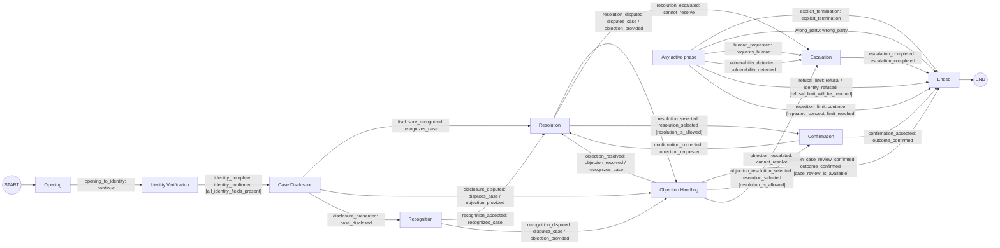

<!-- Generated by scripts/generate-fsm-graph.py; do not edit manually. -->
# FSM business graph

The diagram is generated from `TRANSITION_REGISTRY`, the same ordered
declarations executed by the runtime. Self-transitions and conversational
fallbacks are omitted to keep the business journey readable.
